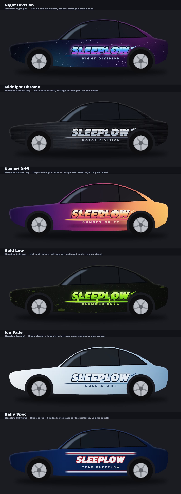

# Wraps « Sleeplow »

Wraps personnalisés pour la visualisation 3D de la Tesla (Toybox → Paint Shop →
Wraps). Six variantes du même lettrage **SLEEPLOW** sur les flancs, à choisir.

> ⚠️ Les PNG ne sont **pas** des images de l'auto : ce sont des patrons à plat
> (dépliage UV). Ouverts tels quels ils ne ressemblent à aucune voiture. Pour
> voir le rendu, regarde la planche de maquettes ci-dessous.

## Les six looks



| Look | Fichier | Description |
| --- | --- | --- |
| **Night Division** | `Sleeplow Night.png` | Ciel de nuit bleu/violet, étoiles, lettrage chrome néon. |
| **Midnight Chrome** | `Sleeplow Chrome.png` | Noir satiné brossé, lettrage chrome poli. Le plus sobre. |
| **Sunset Drift** | `Sleeplow Sunset.png` | Dégradé indigo → rose → orange avec soleil rayé. Le plus chaud. |
| **Acid Low** | `Sleeplow Acid.png` | Noir mat texturé, lettrage vert acide qui coule. Le plus street. |
| **Ice Fade** | `Sleeplow Ice.png` | Blanc glacier → bleu givre, lettrage marine. Le plus propre. |
| **Rally Spec** | `Sleeplow Rally.png` | Bleu course + bandes blanc/rouge sur les portières. Le plus sportif. |

Les maquettes sont des illustrations : les proportions sont approximatives et
l'éclairage du Paint Shop changera un peu le rendu des couleurs.

## Quel dossier prendre

Chaque texture est alignée sur le gabarit officiel d'un modèle précis, donc il
faut **exactement** celui de ton véhicule :

| Véhicule | Dossier |
| --- | --- |
| Model 3 (avant 2024) | [`model3/`](model3/) — les 6 looks |
| Model 3 (2024+) Standard & Premium | [`model3-2024-base/`](model3-2024-base/) — les 6 looks |
| Model 3 (2024+) Performance | [`model3-2024-performance/`](model3-2024-performance/) — les 6 looks |
| Cybertruck | [`cybertruck/`](cybertruck/) |
| Model S (2021+) | [`models-2021/`](models-2021/) |
| Model S (2025+) Plaid | [`models-2025-plaid/`](models-2025-plaid/) |
| Model X (2021+) | [`modelx-2021/`](modelx-2021/) |
| Model Y | [`modely/`](modely/) |
| Model Y (2025+) Standard | [`modely-2025-base/`](modely-2025-base/) |
| Model Y (2025+) Premium | [`modely-2025-premium/`](modely-2025-premium/) |
| Model Y (2025+) Performance | [`modely-2025-performance/`](modely-2025-performance/) |
| Model Y L | [`modely-l/`](modely-l/) |

Les modèles autres que la Model 3 n'ont que *Night Division* de généré. Pour
sortir les autres looks sur n'importe quel modèle :

```bash
python3 tools/sleeplow_wrap.py --model modely --theme rally
```

## Charger le wrap dans l'auto

**Application mobile** (v4.59.0 ou plus récente) : Créations → Wrap → Téléverser,
puis dans l'auto : Toybox → Paint Shop → onglet Wraps.

**Clé USB** : clé formatée en exFAT / FAT32 / MS-DOS FAT / ext3 / ext4 (pas NTFS),
un dossier `Wraps` à la racine, les PNG dedans, et aucun fichier de mise à jour de
cartes ou de firmware sur la clé.

Les fichiers respectent les contraintes Tesla : PNG, 1024 × 1024 (1024 × 768 pour
le Cybertruck), moins de 1 Mo, noms courts en caractères simples. L'auto accepte
jusqu'à 10 wraps depuis l'app et 10 depuis une clé USB, donc les 6 rentrent
ensemble si tu veux comparer directement dans le Paint Shop.

## Régénérer / modifier

```bash
pip install pillow numpy
python3 tools/detect_panels.py     # relit les gabarits -> tools/layout.json
python3 tools/sleeplow_wrap.py     # tous les modèles, tous les looks
python3 tools/mockup.py            # la planche de maquettes
```

Les six looks sont décrits dans [`tools/themes.py`](../tools/themes.py) :
couleurs de fond, dégradé du lettrage, accents, signature. Ajouter une entrée
dans ce fichier suffit pour créer un septième look. Le texte principal est la
constante `WORDMARK` dans [`tools/sleeplow_wrap.py`](../tools/sleeplow_wrap.py).

Les polices (Kanit Black Italic et Archivo Black, licence SIL OFL) sont
téléchargées au premier lancement dans `.fontcache/`, qui n'est pas versionné.
Sans réseau, le script bascule sur DejaVu Sans Bold.

### Comment le lettrage est placé

Les gabarits Tesla sont des dépliages UV : la carrosserie est mise à plat dans une
seule image. Sur tous les modèles sauf le Cybertruck, l'auto est dépliée
verticalement (capot en haut, coffre en bas) et les deux flancs se retrouvent en
bandes verticales sur les bords gauche et droit de l'image. Le lettrage doit donc
être écrit tourné à 90°, et **en sens inverse d'un côté à l'autre** :

* bande de gauche → visuel tourné dans le sens horaire ;
* bande de droite → visuel tourné dans le sens antihoraire.

Le Cybertruck, lui, déplie ses flancs en bandes horizontales : celle du bas est à
l'endroit, celle du haut est retournée verticalement.

Ces deux conventions ont été déduites des wraps fournis par Tesla dans ce dépôt
(`model3/example/Rudi.png` et `cybertruck/example/Graffiti_green.png`).
`tools/detect_panels.py` repère ensuite automatiquement les portières de chaque
gabarit pour que le lettrage tombe sur la tôle et pas dans un passage de roue.
