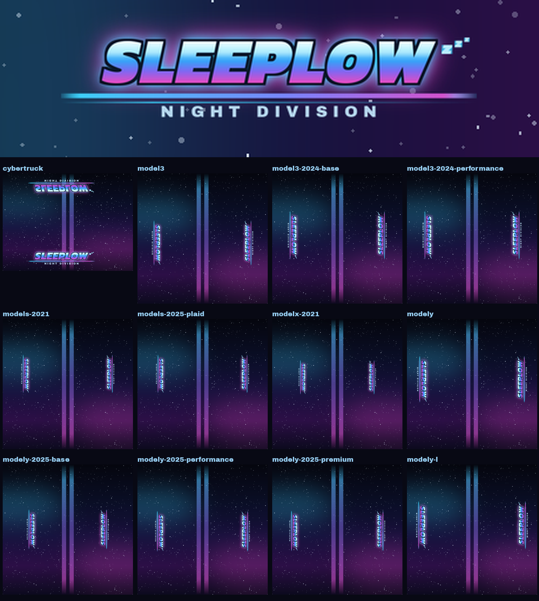

# Wrap « Sleeplow »

Wrap personnalisé pour la visualisation 3D de la Tesla (Toybox → Paint Shop → Wraps).
Fond nuit dégradé bleu nuit → violet avec champ d'étoiles, double bande centrale
sur le capot / toit / coffre, et le lettrage **SLEEPLOW** en chrome néon des deux
côtés du véhicule, avec la ligne de vitesse, la signature *NIGHT DIVISION* et les
petits « z » qui s'échappent.



## Choisir son fichier

Un dossier par modèle — chaque texture est déjà alignée sur le gabarit officiel
du modèle, donc il faut prendre **exactement** celui de ton véhicule :

| Véhicule | Fichier |
| --- | --- |
| Cybertruck | [`cybertruck/Sleeplow.png`](cybertruck/Sleeplow.png) |
| Model 3 | [`model3/Sleeplow.png`](model3/Sleeplow.png) |
| Model 3 (2024+) Standard & Premium | [`model3-2024-base/Sleeplow.png`](model3-2024-base/Sleeplow.png) |
| Model 3 (2024+) Performance | [`model3-2024-performance/Sleeplow.png`](model3-2024-performance/Sleeplow.png) |
| Model S (2021+) | [`models-2021/Sleeplow.png`](models-2021/Sleeplow.png) |
| Model S (2025+) Plaid | [`models-2025-plaid/Sleeplow.png`](models-2025-plaid/Sleeplow.png) |
| Model X (2021+) | [`modelx-2021/Sleeplow.png`](modelx-2021/Sleeplow.png) |
| Model Y | [`modely/Sleeplow.png`](modely/Sleeplow.png) |
| Model Y (2025+) Standard | [`modely-2025-base/Sleeplow.png`](modely-2025-base/Sleeplow.png) |
| Model Y (2025+) Premium | [`modely-2025-premium/Sleeplow.png`](modely-2025-premium/Sleeplow.png) |
| Model Y (2025+) Performance | [`modely-2025-performance/Sleeplow.png`](modely-2025-performance/Sleeplow.png) |
| Model Y L | [`modely-l/Sleeplow.png`](modely-l/Sleeplow.png) |

## Charger le wrap dans l'auto

**Application mobile** (v4.59.0 ou plus récente) : Créations → Wrap → Téléverser,
puis dans l'auto : Toybox → Paint Shop → onglet Wraps.

**Clé USB** : clé formatée en exFAT / FAT32 / MS-DOS FAT / ext3 / ext4 (pas NTFS),
un dossier `Wraps` à la racine, le PNG dedans, et aucun fichier de mise à jour de
cartes ou de firmware sur la clé.

Le fichier respecte les contraintes Tesla : PNG, 1024 × 1024 (1024 × 768 pour le
Cybertruck), moins de 1 Mo, nom court en caractères simples.

## Régénérer / modifier

```bash
pip install pillow numpy
python3 tools/detect_panels.py          # relit les gabarits → tools/layout.json
python3 tools/sleeplow_wrap.py          # écrit sleeplow/<modèle>/Sleeplow.png
python3 tools/sleeplow_wrap.py --model modely   # un seul modèle
```

Pour changer le texte ou les couleurs, ce sont les constantes `WORDMARK`,
`TAGLINE`, `SKY` et `INK` en haut de [`tools/sleeplow_wrap.py`](../tools/sleeplow_wrap.py).

Les polices (Kanit Black Italic et Archivo Black, licence SIL OFL) sont
téléchargées au premier lancement dans `.fontcache/`, qui n'est pas versionné.
Sans réseau, le script bascule sur DejaVu Sans Bold.

### Comment le lettrage est placé

Les gabarits Tesla sont des dépliages UV : la carrosserie est mise à plat dans une
seule image. Sur tous les modèles sauf le Cybertruck, l'auto est dépliée
verticalement (capot en haut, coffre en bas) et les deux flancs se retrouvent en
bandes verticales sur les bords gauche et droit de l'image. Le lettrage doit donc
être écrit tourné à 90°, et **en sens inverse d'un côté à l'autre** :

* bande de gauche → visuel tourné dans le sens horaire ;
* bande de droite → visuel tourné dans le sens antihoraire.

Le Cybertruck, lui, déplie ses flancs en bandes horizontales : celle du bas est à
l'endroit, celle du haut est retournée verticalement.

Ces deux conventions ont été déduites des wraps fournis par Tesla dans ce dépôt
(`model3/example/Rudi.png` et `cybertruck/example/Graffiti_green.png`).
`tools/detect_panels.py` repère ensuite automatiquement les portières de chaque
gabarit pour que le lettrage tombe sur la tôle et pas dans un passage de roue.
